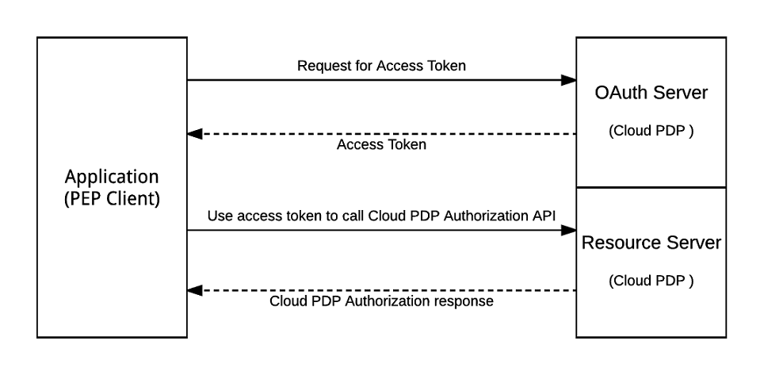

# NextLabs PDP REST Interface API

## Introduction

---

This document describes the PDP REST API and shows how to authenticate and send a standard XACML request and how to send a permissions request and interpret the response.

## Accessing PDP REST API

## Authentication
---
The PDP REST API uses the OAuth 2.0 protocol for authentication. To use the REST API, you must first obtain an OAuth 2.0 client credentials from the Control Center OAuth server. Your client application then requests an access token from the Control Center OAuth Server or the PDP, extracts the token from the response, and sends the token along with the request to the PDP Authorization API.



### Request for Access Token

The Control Center and PDP support OAuth2 [Client Credentials Grant](https://tools.ietf.org/html/rfc6749#section-4.4).

#### Access Token Request Endpoint

An access token may be requested from one of two different endpoints - the Control Center or the PDP to which the REST call will be made

Control Center Token Request Endpoint: `https://<Control Center Host>/cas/token`

PDP Token Request Endpoint: `https://<pdp>/dpc/oauth`

#### Access Token Request

The client application makes a request to either token endpoint by adding the following parameters using "application/x-www-form-urlencoded" with a character encoding of UTF-8 in the HTTP request entity-body:

* `grant_type` REQUIRED. The value MUST be set to "client_credentials".
* `client_id` REQUIRED.  The API Client ID
* `client_secret` REQUIRED.  The API Client Secret.
* `expires_in` OPTIONAL. The number of seconds for which the token is valid. If this parameter is omitted, a token valid for one hour (3600 seconds) will be returned. Users may request tokens valid for up to one year (31536000 seconds).

Sample request:

```
POST /cas/token HTTP/1.1
Host: cc-server.example.com
Content-Type: application/x-www-form-urlencoded

grant_type=client_credentials&client_id=apiclient&client_secret=ABCDEFGABCDEFG
```

#### Access Token Response

If the access token request is valid and authorized, the OAuth Server issues an access token.

Sample response:

```
HTTP/1.1 200 OK
{
    "access_token":"2YotnFZFEjr1zCsicMWpAA",
    "token_type":"Bearer",
    "expires_in":3600
}
```


## Sending a Simple XACML Evaluation Request

---

* Any standard REST Client like Postman or ARC (Advanced REST Client) can be used to send requests to PDP REST API.
* HTTP Method: **`POST`**
* Request URI or REST end point: **`https://<PDP REST Host>:<PDP REST Port>/dpc/authorization/pdp`**

### REST request

Header Key |  Header Value  | Description
---|-----|---
Content-Type | **application/json** or **application/xml** | mandatory parameter to identify the request data type, supports only **application/json** or **application/xml**
Service | EVAL | Type of Service Requested
Version | 1.0  | API Version

**XACML** based json or xml request data sent as HTTP body. Please refer to the sample below for further details.


### Parameterized POST Request

Parameter Key |  Parameter Value  | Description
---|-----|---
DataType | **xml** or **json** | Data Type of the Request (XML or JSON)
Service | EVAL | Type of Service Requested
Version | 1.0 | API Version
data | XACML Request Payload. Please refer to the sample shown below for further details | Request Data sent for    evaluation, in XML or JSON format

#### Sample JSON Request

```json
{
  "Request":{
    "ReturnPolicyIdList":"true",
    "Category":[
      {
        "CategoryId":"urn:oasis:names:tc:xacml:1.0:subject-category:access-subject",
        "Attribute":[
          {
            "AttributeId":"urn:oasis:names:tc:xacml:1.0:subject:subject-id",
            "Value":"chris.weber@hdesk.com",
            "IncludeInResult":"false"
          },
          {
            "AttributeId":"urn:oasis:names:tc:xacml:1.0:subject:assigned_prod_area",
            "Value":"Exchange Email",
            "IncludeInResult":"false"
          },
          {
            "AttributeId":"urn:oasis:names:tc:xacml:1.0:subject:department",
            "Value":"IT",
            "IncludeInResult":"false"
          }
        ]
      },
      {
        "CategoryId":"urn:oasis:names:tc:xacml:3.0:attribute-category:resource",
        "Attribute":[
          {
            "DataType":"http://www.w3.org/2001/XMLSchema#anyURI",
            "AttributeId":"urn:oasis:names:tc:xacml:1.0:resource:resource-id",
            "Value":"Ticket:1103",
            "IncludeInResult":"false"
          },
          {
            "DataType":"http://www.w3.org/2001/XMLSchema#anyURI",
            "AttributeId":"urn:nextlabs:names:evalsvc:1.0:resource:resource-type",
            "Value":"support_tickets",
            "IncludeInResult":"false"
          },
          {
            "DataType":"http://www.w3.org/2001/XMLSchema#anyURI",
            "AttributeId":"urn:oasis:names:tc:xacml:1.0:resource:prod_name",
            "Value":"Exchange Email",
            "IncludeInResult":"false"
          }
        ]
      },
      {
        "CategoryId":"urn:oasis:names:tc:xacml:3.0:attribute-category:action",
        "Attribute":[
          {
            "DataType":"http://www.w3.org/2001/XMLSchema#string",
            "AttributeId":"urn:oasis:names:tc:xacml:1.0:action:action-id",
            "Value":"EDIT_TKTS",
            "IncludeInResult":"false"
          }
        ]
      },
      {
        "CategoryId":"urn:nextlabs:names:evalsvc:1.0:attribute-category:application",
        "Attribute":[
          {
            "DataType":"http://www.w3.org/2001/XMLSchema#string",
            "AttributeId":"urn:nextlabs:names:evalsvc:1.0:application:application-id",
            "Value":"Helpdesk",
            "IncludeInResult":"false"
          }
        ]
      },
      {
        "CategoryId":"urn:oasis:names:tc:xacml:3.0:attribute-category:environment",
        "Attribute":[
          {
            "DataType":"http://www.w3.org/2001/XMLSchema#dateTime",
            "AttributeId":"urn:oasis:names:tc:xacml:1.0:environment:authentication_type",
            "Value":"multifactor",
            "IncludeInResult":"false"
          }
        ]
      }
    ]
  }
}
```

#### JSON Response

Response contains the result of the single request evaluation. Result has decision, status and list of obligations for the authorization request

```json
{
  "Response": {
    "Result": [{
      "Decision": "Permit",
      "Status": {
        "StatusMessage": "success",
        "StatusCode": {
          "Value": "urn:oasis:names:tc:xacml:1.0:status:ok"
        }
      },
      "Obligations": []
    }]
  }
}
```

#### Sample XML Request


```xml
<?xml version="1.0" encoding="UTF-8"?>
<Request xmlns="urn:oasis:names:tc:xacml:3.0:core:schema:wd-17" xmlns:xsi="http://www.w3.org/2001/XMLSchema-instance" xsi:schemaLocation="urn:oasis:names:tc:xacml:3.0:core:schema:wd-17 http://docs.oasis-open.org/xacml/3.0/xacml-core-v3-schema-wd-17.xsd" ReturnPolicyIdList="false">
   <Attributes Category="urn:oasis:names:tc:xacml:1.0:subject-category:access-subject">
      <Attribute IncludeInResult="false" AttributeId="urn:oasis:names:tc:xacml:1.0:subject:subject-id">
         <AttributeValue DataType="http://www.w3.org/2001/XMLSchema#string">chris.weber@hdesk.com</AttributeValue>
      </Attribute>
      <Attribute IncludeInResult="false" AttributeId="urn:oasis:names:tc:xacml:1.0:subject:department">
         <AttributeValue DataType="http://www.w3.org/2001/XMLSchema#string">IT</AttributeValue>
      </Attribute>
   </Attributes>
   <Attributes Category="urn:oasis:names:tc:xacml:3.0:attribute-category:resource">
      <Attribute IncludeInResult="false" AttributeId="urn:oasis:names:tc:xacml:1.0:resource:resource-id">
         <AttributeValue DataType="http://www.w3.org/2001/XMLSchema#String">Ticket:1103</AttributeValue>
      </Attribute>
      <Attribute IncludeInResult="false" AttributeId="urn:nextlabs:names:evalsvc:1.0:resource:resource-type">
         <AttributeValue DataType="http://www.w3.org/2001/XMLSchema#String">support_tickets</AttributeValue>
      </Attribute>
   </Attributes>
   <Attributes Category="urn:oasis:names:tc:xacml:3.0:attribute-category:action">
      <Attribute IncludeInResult="false" AttributeId="urn:oasis:names:tc:xacml:1.0:action:action-id">
         <AttributeValue DataType="http://www.w3.org/2001/XMLSchema#string">VIEW_TKTS</AttributeValue>
      </Attribute>
   </Attributes>
   <Attributes Category="urn:nextlabs:names:evalsvc:1.0:attribute-category:application">
      <Attribute IncludeInResult="false" AttributeId="urn:nextlabs:names:evalsvc:1.0:application:application-id">
         <AttributeValue DataType="http://www.w3.org/2001/XMLSchema#String">Helpdesk</AttributeValue>
      </Attribute>
   </Attributes>
   <Attributes Category="urn:oasis:names:tc:xacml:3.0:attribute-category:environment">
      <Attribute AttributeId="authentication_type" Issuer="" IncludeInResult="false">
         <AttributeValue DataType="http://www.w3.org/2001/XMLSchema#string">multifactor</AttributeValue>
      </Attribute>
   </Attributes>
</Request>
```

#### XML Response

```xml
<?xml version="1.0" encoding="UTF-8" standalone="yes"?>
<Response xmlns="urn:oasis:names:tc:xacml:3.0:core:schema:wd-17">
    <Result>
        <Decision>Permit</Decision>
        <Status>
            <StatusCode Value="urn:oasis:names:tc:xacml:1.0:status:ok"/>
            <StatusMessage>success</StatusMessage>
        </Status>
        <Obligations/>
    </Result>
</Response>
```

### Additional Details

---

* **XACML Support**
  NextLabs PDP REST API is based on XACML REST profile, it supports request/response in both xml and json format. Each request is composed of one or more categories namely Subject, Resource, Action and Application being mandatory. If one of these categories in missing, the request is invalid. The Environment category is optional.

#### Standard XACML Request Categories

* **Subject**
  * **Category Id** : `urn:oasis:names:tc:xacml:1.0:subject-category:access-subject`
  * **Attribute Prefix** : `urn:oasis:names:tc:xacml:1.0:subject:<subject-attribute-id>`
  * `subject-id` or `name` is mandatory, all other attributes are optional.

* **Resource**
  * **Category Id** : `urn:oasis:names:tc:xacml:3.0:attribute-category:resource`
  * **Attribute Prefix** : `urn:oasis:names:tc:xacml:1.0:resource:_<resource-attribute-id>`
  * `resource-id` is a mandatory attribute.  If it is not specified, request is invalid.
  * `urn:nextlabs:names:evalsvc:1.0:resource:resource-type` is a mandatory attribute. This will be used to identify the NextLabs specific resource type or policy model type. The value of resource-type should be equal to the short_name of the Resource Type selected during resource component creation.
  * `urn:nextlabs:names:evalsvc:1.0:resource:resource-dimension` is another NextLabs specific attribute. It has has two permissible values, `to` and `from`. A resource with dimension `from` represents the source,  and one with `to` represents destination. If no dimension is specified, `from` will be assigned by default. Destination cannot be specified without source, so if only a resource with `to` dimension is specified, request is invalid and an appropriate message is displayed to the user. Similarly if an invalid dimension (apart from "to" or "from") is specified, request becomes invalid.
  * Another important resource attribute is `nocache`, and if its value is specified as `yes` as in the example below, PDP will not cache this particular resource attributes.

* **Action**
  * **Category Id** : `urn:oasis:names:tc:xacml:3.0:attribute-category:action`
  * **Attribute Prefix** : `urn:oasis:names:tc:xacml:1.0:action:action-id`
  * `action-id` is the only permissible attribute here

#### NextLabs Specific Request Categories

* **Application**
  * **Category Id** : `urn:nextlabs:names:evalsvc:1.0:attribute-category:application`
  * **Attribute Prefix** :  `urn:nextlabs:names:evalsvc:1.0:application:<application-attribute-id>`


## Sending a Simple Permissions Request

---

A permissions request allows the caller to determine what actions would be allowed or denied if a request were made by a user for a particular result, which obligations would be performed for a particular action, and which policies would be applicable.

The request structure itself is identical to the Evaluation Request, with the exception that no action is specified.

* Any standard REST Client like Postman or ARC (Advanced REST Client) can be used to send requests to PDP REST API.
* HTTP Method: **`POST`**
* Request URI or REST end point: **`https://<PDP REST Host>:<PDP REST Port>/dpc/authorization/pdppermissions`**

### REST request

Header Key |  Header Value  | Description
---|-----|---
Content-Type | **application/json** or **application/xml** | mandatory parameter to identify the request data type, supports only **application/json** or **application/xml**
Service | EVAL | Type of Service Requested
Version | 1.0  | API Version

**XACML** based json or xml request data sent as HTTP body. Please refer to the sample below for further details.


### Parameterized POST Request

Parameter Key |  Parameter Value  | Description
---|-----|---
DataType | **xml** or **json** | Data Type of the Request (XML or JSON)
Service | EVAL | Type of Service Requested
Version | 1.0 | API Version
data | Request Payload. Please refer to the sample shown below for further details | Request Data sent for evaluation, in XML or JSON format


#### Sample JSON Request

```json
{
  "Request":{
    "ReturnPolicyIdList":"true",
    "Category":[
      {
        "CategoryId":"urn:oasis:names:tc:xacml:1.0:subject-category:access-subject",
        "Attribute":[
          {
            "AttributeId":"urn:oasis:names:tc:xacml:1.0:subject:subject-id",
            "Value":"chris.weber@hdesk.com",
            "IncludeInResult":"false"
          },
          {
            "AttributeId":"urn:oasis:names:tc:xacml:1.0:subject:assigned_prod_area",
            "Value":"Exchange Email",
            "IncludeInResult":"false"
          },
          {
            "AttributeId":"urn:oasis:names:tc:xacml:1.0:subject:department",
            "Value":"IT",
            "IncludeInResult":"false"
          }
        ]
      },
      {
        "CategoryId":"urn:oasis:names:tc:xacml:3.0:attribute-category:resource",
        "Attribute":[
          {
            "DataType":"http://www.w3.org/2001/XMLSchema#anyURI",
            "AttributeId":"urn:oasis:names:tc:xacml:1.0:resource:resource-id",
            "Value":"Ticket:1103",
            "IncludeInResult":"false"
          },
          {
            "DataType":"http://www.w3.org/2001/XMLSchema#anyURI",
            "AttributeId":"urn:nextlabs:names:evalsvc:1.0:resource:resource-type",
            "Value":"support_tickets",
            "IncludeInResult":"false"
          },
          {
            "DataType":"http://www.w3.org/2001/XMLSchema#anyURI",
            "AttributeId":"urn:oasis:names:tc:xacml:1.0:resource:prod_name",
            "Value":"Exchange Email",
            "IncludeInResult":"false"
          }
        ]
      },
      {
        "CategoryId":"urn:nextlabs:names:evalsvc:1.0:attribute-category:application",
        "Attribute":[
          {
            "DataType":"http://www.w3.org/2001/XMLSchema#string",
            "AttributeId":"urn:nextlabs:names:evalsvc:1.0:application:application-id",
            "Value":"Helpdesk",
            "IncludeInResult":"false"
          }
        ]
      },
      {
        "CategoryId":"urn:oasis:names:tc:xacml:3.0:attribute-category:environment",
        "Attribute":[
          {
            "DataType":"http://www.w3.org/2001/XMLSchema#dateTime",
            "AttributeId":"nextlabs-record-matching-policies-in-result",
            "Value":"true",
            "IncludeInResult":"false"
          }
        ]
      }
    ]
  }
}
```

#### JSON Response

```json
{
    "Status": {
        "StatusCode": {
            "Value": "urn:oasis:names:tc:xacml:1.0:status:ok"
        }
    },
    "Response": [
        {
            "ActionsAndObligations": {
                "allow": [
                    {
                        "Action": "OPEN",
                        "MatchingPolicies": [
                            "ROOT_122/OPEN Policy"
                        ],
                        "Obligations": [
                            {
                                "Id": "Obligation 1",
                                "AttributeAssignment": [
                                    {
                                        "AttributeId": "arg1",
                                        "Value": [
                                            "val1"
                                        ],
                                        "Category": "urn:nextlabs:names:evalsvc:1.0:attribute-category:obligation-attrAssignment",
                                        "DataType": "http://www.w3.org/2001/XMLSchema#string"
                                    },
                                    {
                                        "AttributeId": "policy_model_id",
                                        "Value": [
                                            "23"
                                        ],
                                        "Category": "urn:nextlabs:names:evalsvc:1.0:attribute-category:obligation-attrAssignment",
                                        "DataType": "http://www.w3.org/2001/XMLSchema#string"
                                    }
                                ]
                            }
                        ]
                    },
                    {
                        "Action": "SEND",
                        "MatchingPolicies": [
                            "ROOT_122/OPEN Policy",
                            "ROOT_122/SEND Policy"
                        ],
                        "Obligations": [
                            {
                                "Id": "Obligation 1",
                                "AttributeAssignment": [
                                    {
                                        "AttributeId": "arg1",
                                        "Value": [
                                            "val1"
                                        ],
                                        "Category": "urn:nextlabs:names:evalsvc:1.0:attribute-category:obligation-attrAssignment",
                                        "DataType": "http://www.w3.org/2001/XMLSchema#string"
                                    },
                                    {
                                        "AttributeId": "policy_model_id",
                                        "Value": [
                                            "23"
                                        ],
                                        "Category": "urn:nextlabs:names:evalsvc:1.0:attribute-category:obligation-attrAssignment",
                                        "DataType": "http://www.w3.org/2001/XMLSchema#string"
                                    }
                                ]
                            }
                        ]
                    }
                ],
                "deny": [
                    {
                        "Action": "DELETE",
                        "MatchingPolicies": [
                            "ROOT_122/DELETE Policy"
                        ],
                        "Obligations": []
                    }
                ],
                "dontcare": []
            }
        }
    ]
}
```

#### Sample XML Request

```xml
<?xml version="1.0" encoding="UTF-8"?>
<Request xmlns="urn:oasis:names:tc:xacml:3.0:core:schema:wd-17" xmlns:xsi="http://www.w3.org/2001/XMLSchema-instance" xsi:schemaLocation="urn:oasis:names:tc:xacml:3.0:core:schema:wd-17 http://docs.oasis-open.org/xacml/3.0/xacml-core-v3-schema-wd-17.xsd" ReturnPolicyIdList="false">
   <Attributes Category="urn:oasis:names:tc:xacml:1.0:subject-category:access-subject">
      <Attribute IncludeInResult="false" AttributeId="urn:oasis:names:tc:xacml:1.0:subject:subject-id">
         <AttributeValue DataType="http://www.w3.org/2001/XMLSchema#string">chris.weber@hdesk.com</AttributeValue>
      </Attribute>
      <Attribute IncludeInResult="false" AttributeId="urn:oasis:names:tc:xacml:1.0:subject:department">
         <AttributeValue DataType="http://www.w3.org/2001/XMLSchema#string">IT</AttributeValue>
      </Attribute>
   </Attributes>
   <Attributes Category="urn:oasis:names:tc:xacml:3.0:attribute-category:resource">
      <Attribute IncludeInResult="false" AttributeId="urn:oasis:names:tc:xacml:1.0:resource:resource-id">
         <AttributeValue DataType="http://www.w3.org/2001/XMLSchema#String">Ticket:1103</AttributeValue>
      </Attribute>
      <Attribute IncludeInResult="false" AttributeId="urn:nextlabs:names:evalsvc:1.0:resource:resource-type">
         <AttributeValue DataType="http://www.w3.org/2001/XMLSchema#String">support_tickets</AttributeValue>
      </Attribute>
   </Attributes>
   <Attributes Category="urn:nextlabs:names:evalsvc:1.0:attribute-category:application">
      <Attribute IncludeInResult="false" AttributeId="urn:nextlabs:names:evalsvc:1.0:application:application-id">
         <AttributeValue DataType="http://www.w3.org/2001/XMLSchema#String">Helpdesk</AttributeValue>
      </Attribute>
   </Attributes>
   <Attributes Category="urn:oasis:names:tc:xacml:3.0:attribute-category:environment">
      <Attribute AttributeId="authentication_type" Issuer="" IncludeInResult="false">
         <AttributeValue DataType="http://www.w3.org/2001/XMLSchema#string">multifactor</AttributeValue>
      </Attribute>
      <Attribute AttributeId="nextlabs-record-matching-policies-in-result" Issuer="" IncludeInResult="false">
         <AttributeValue DataType="http://www.w3.org/2001/XMLSchema#string">true</AttributeValue>
      </Attribute>
   </Attributes>
</Request>
```

#### XML Response
```xml
<?xml version="1.0" encoding="UTF-8" standalone="yes"?>
<ns3:PermissionsResponsesType xmlns:ns2="urn:oasis:names:tc:xacml:3.0:core:schema:wd-17" xmlns:ns3="urn:nextlabs:names:permsvc:1.0:response">
    <permissionsResponse>
        <actionObligationsListMap>
            <entry>
                <key>allow</key>
                <value>
                    <actionObligations>
                        <action>OPEN</action>
                        <matchingPolicies>ROOT_122/OPEN Policy</matchingPolicies>
                        <obligations>
                            <ns2:Obligation ObligationId="Obligation Name">
                                <ns2:AttributeAssignment AttributeId="arg1" Category="urn:nextlabs:names:evalsvc:1.0:attribute-category:obligation-attrAssignment" DataType="http://www.w3.org/2001/XMLSchema#string">val1</ns2:AttributeAssignment>
                                <ns2:AttributeAssignment AttributeId="policy_model_id" Category="urn:nextlabs:names:evalsvc:1.0:attribute-category:obligation-attrAssignment" DataType="http://www.w3.org/2001/XMLSchema#string">23</ns2:AttributeAssignment>
                            </ns2:Obligation>
                        </obligations>
                    </actionObligations>
                    <actionObligations>
                        <action>SEND</action>
                        <matchingPolicies>ROOT_122/SEND Policy</matchingPolicies>
                        <obligations>
                            <ns2:Obligation ObligationId="Obligation Name">
                                <ns2:AttributeAssignment AttributeId="arg1" Category="urn:nextlabs:names:evalsvc:1.0:attribute-category:obligation-attrAssignment" DataType="http://www.w3.org/2001/XMLSchema#string">val1</ns2:AttributeAssignment>
                                <ns2:AttributeAssignment AttributeId="policy_model_id" Category="urn:nextlabs:names:evalsvc:1.0:attribute-category:obligation-attrAssignment" DataType="http://www.w3.org/2001/XMLSchema#string">23</ns2:AttributeAssignment>
                            </ns2:Obligation>
                        </obligations>
                    </actionObligations>
                </value>
            </entry>
            <entry>
                <key>deny</key>
                <value>
                    <actionObligations>
                        <action>DELETE</action>
                        <matchingPolicies>ROOT_122/DELETE Policy</matchingPolicies>
                        <obligations/>
                    </actionObligations>
                </value>
            </entry>
            <entry>
                <key>dontcare</key>
                <value/>
            </entry>
        </actionObligationsListMap>
    </permissionsResponse>
</ns3:PermissionsResponsesType>
```

### Additional Details

---

As noted elsewhere, the permissions request format, both JSON and XML, is identical to the XACML Request format, with the exception that the Action category is omitted. The Subject, Resource, and Application categories are required and the Environment category is optional.


#### Standard XACML Request Categories

In addition to those that appear in the XACML Request

* **Environment**
  * `nextlabs-record-matching-policies-in-result` is a NextLabs specific attribute. It is either `true` or `false` (the default). If set to `true` then the names of applicable policies will be included for each action in the permissions response.
